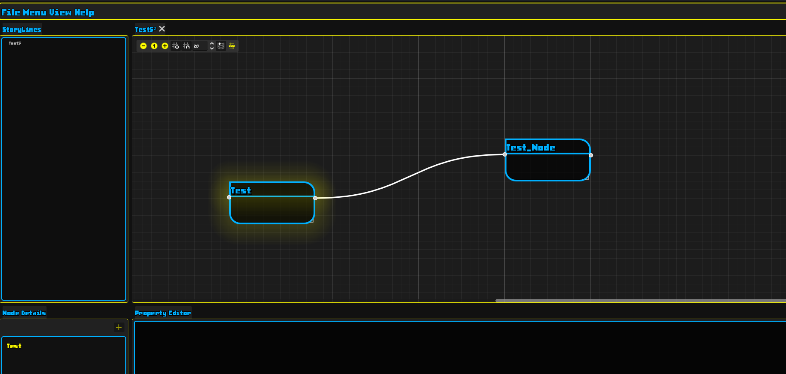

# Story Graph

## Introduction

Story Graph aims to make forming data relationships less taxing by adding a visual graphical element between the narrative designer and data modelled. Build in Godot version 4.5, as Godot has amazing capabilities when comes to building user interfaces. The engine also came with functionality such as a graph and node system that greatly saved me time and increased my agility. The godot documentation is also extremely friendly, as when I first started this project i was using Qt and QML. That was cumbersome, as the Qt documentation is harder to navigate than Godot's. The GDScripting language, offers reasonable speed for most task's and its simplistic design and how it's coupled with the editor offers great agility and dev experience. That is my reasoning for choosing the Godot Engine for this project.

## Project Features

Below I will include a snapshot of the project's backlog to give an overview of the features I am to implement in this application.

## Current Progress

The snapshot belows show's the current progress I have made on the project, and the overall task's needing to be completed. I have gotten most of the back bone done already, such as serializing data from node's and level's, saving and loading data, and creating a project structure. It is almost ready for alpha because the bare minimum use case of modeling level contained narratives for video games is nearly complete and ready for testing.

## Project Showcase

### The Project Hub

This window allows for project management. Selecting a project, deleting projects, renaming or creating a new project.

### Multiple Level's

You can have multiple level's open at a time, each level control their own state, and only the active level can be edited.

### Node Properties

Node properties are the data contained on that node. Property types range from primitive types such as, int, float, bool, and container types such as Array's and Dictionaries. They can hold strings(text) as well. Nested container types are supported as well. During testing I have made some pretty gnarly nests. There is an editor for adding new properties to the node, or updating the existing properties on the currently selected node. Since the storing of properties is essentially a dictionary. I have implemented a solution to ensure that a user can not overwrite an existing property.

#### Adding Properties

#### Updating properties

### Node Linking

Node links, as of right now only show a link, the feature is not implemented. However, I will go into the design of how I plan to handle this for now, but also add a more robust and agnostic approach as well. My design intention is for a graph to a be a level, a level will work like a table in a database. The node's are rows, and their link's will be the column. The application keeps track of a level id and the level will keep track of the node id. Ensuring they are unique. When a link is created the from node becomes a prerequisite for the to node. Thus, making it easy to lay out linear narrative's such as campaigns. But, a free hanging node, can still be within the graph with no connections and be exported as a quest. I also plan to add a node that will link a node or group of nodes from one level, to the level the node resides in. Think of World of Warcraft, of how there are quest's in one zone, that will take you to another zone. That feature should be able to handle that type of design, in a light weight fashion, as upon export, it add a structure like: {level_id-node-id} as a prerequisite for the linked node, so you can program that this quest is only available if the player has picked up that quest from the other zone. This is the design intention, once I get this implemented. I plan to give the user a more agnostic approach of handling their own primary and foreign keys for their node connections. This will be a project setting.

### Exporting

I plan to include JSON and CSV. A bit of a challenge that if I get to, I want to have it link to a database and generate the table's right from Story Graph.

## Conclusion

I appreciate you taking the time reading this project README. It's an ambitious project, but something that I have wanted to do for quite some time. If you would like to build the program. A Godot version of 4.5 will work, you don't need .NET as I haven't included any C# yet, but that might change at a later date. I recently built my godot engine with .NET because I want to use interface's for a few features within the project, and GDScript does not offer that powerful feature. Once I get to a reasonable build for alpha I will add a release.
