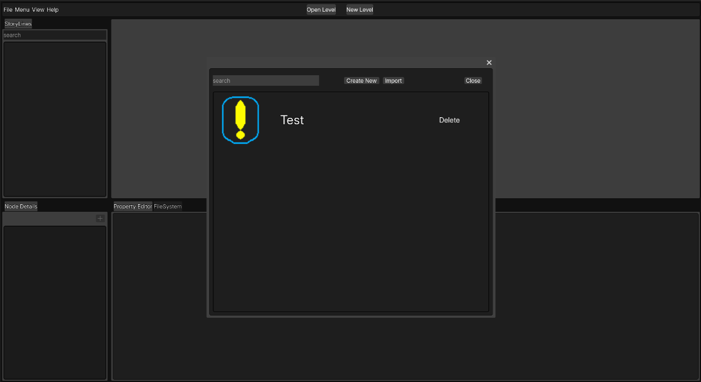
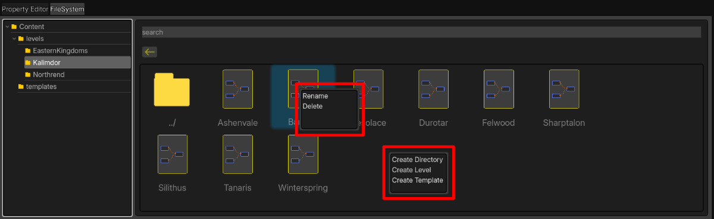
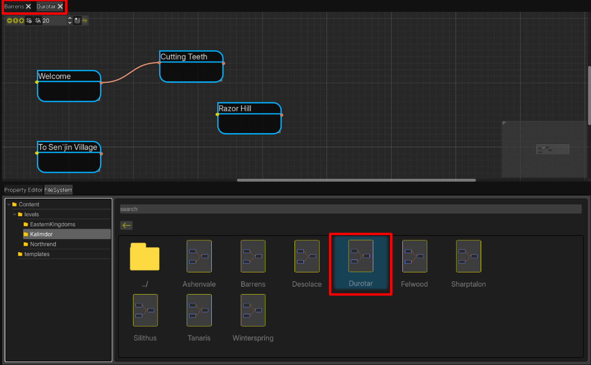
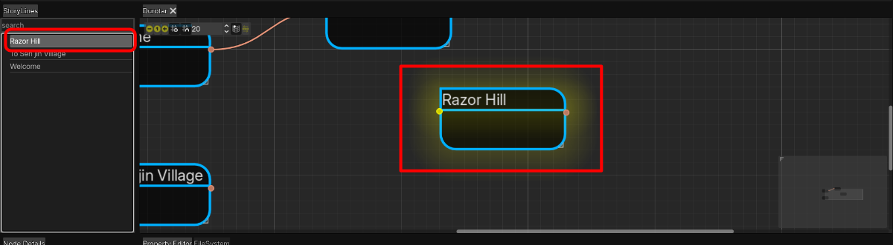
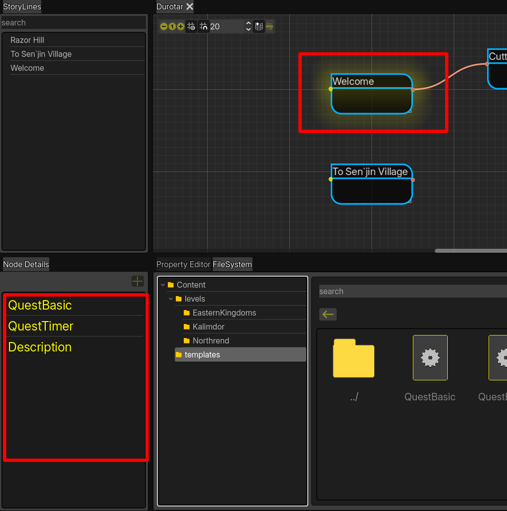
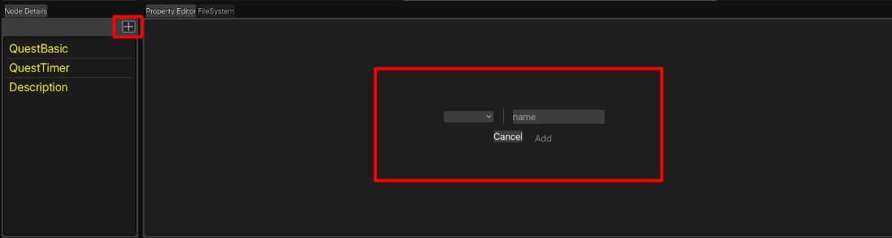
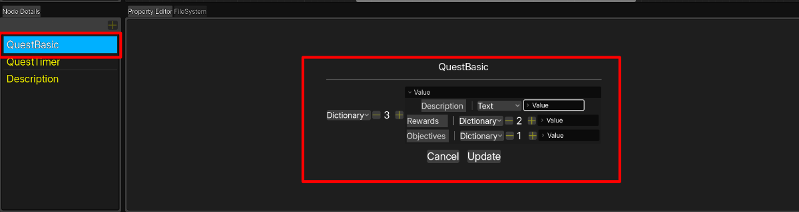
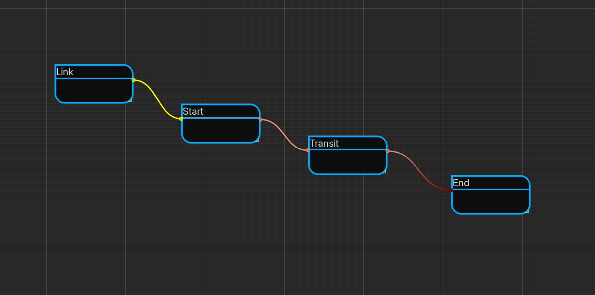
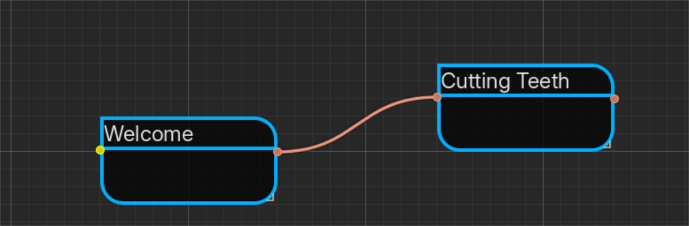
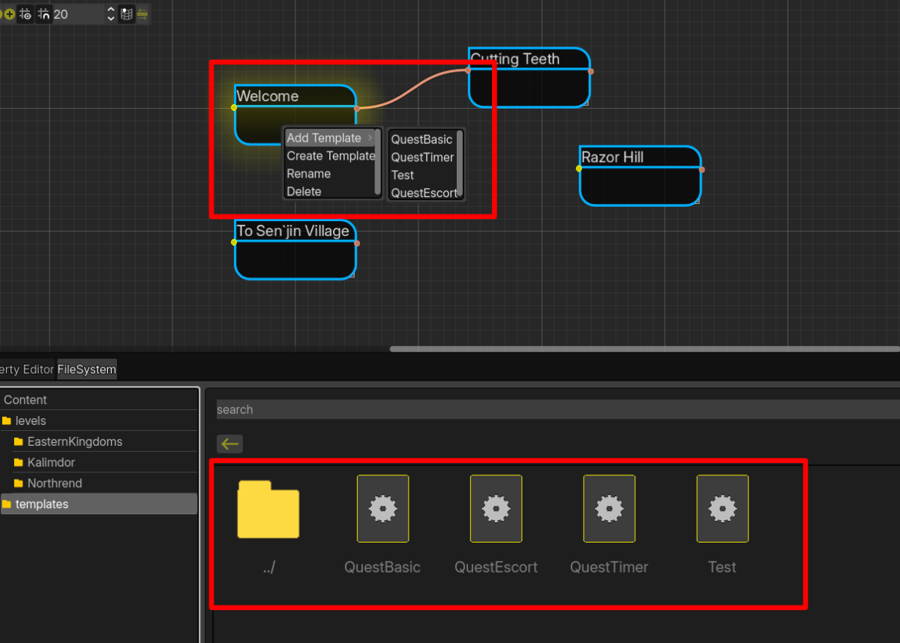

# Story Graph

## Introduction

Story Graph aims to make forming data relationships less taxing by adding a visual graphical element between the narrative designer and data modelled. Build in Godot version 4.5, as Godot has amazing capabilities when comes to building user interfaces. The engine also came with functionality such as a graph and node system that greatly saved me time and increased my agility. The godot documentation is also extremely friendly, as when I first started this project i was using Qt and QML. That was cumbersome, as the Qt documentation is harder to navigate than Godot's. The GDScripting language, offers reasonable speed for most task's and its simplistic design and how it's coupled with the editor offers great agility and dev experience. That is my reasoning for choosing the Godot Engine for this project.

## Project Showcase

### The Project Hub

This window allows for project management. Selecting a project, deleting projects, renaming or creating a new project. It lists all of the recent project's associated with Story Graph, if you move a project, it will need to be reimported.

### File System

Story Graph has a file system, it is simple in nature and only allows for common file operations. Creating/Renaming/Moving. The file tree only displays directories at the moment but I plan to allow for file's to be viewed in the file tree with a setting. Also, thumbnails are only supported at the minute. I plan to implement a list view in the future. The file system context menu is aware of what requested the context menu, and the selections are only available for the appropriate context.

### Opening Levels

The file system supports opening level's and will open templates later. I have not implemented that as of yet, but double clicking a level thumbnail will load it and add it to the editor. You can also open level's via the menu bar->file->open level option, or with open level button at the top of the editor. Multiple level's can be open, a tab will be added to the editor for the level.

### Navigating Levels

There is an inspector on the left side of the level editor called "story lines." This inspector tracks the start node's within the level. You can click on a node and the level editor will select and focus the clicked tree item.

### Node Properties

Node properties are the data contained on that node. Property types range from primitive types such as, int, float, bool, and container types such as Array's and Dictionaries. A new addition to node properties is the concept of templates. I will describe what templates are and how they are created below. They can be added to nodes in a composition style, building up the node's data in chunks. When data templates are edited via Story Graph, a global reference manager will update each node that references that template. The functionality can also be ignored by making the node independent. By doing that the node will not be updated for that template. Template update's do not affect values already set on nodes. However, the caveat is, if you delete a property from the template, it will delete from the node as well, losing it's data. I intend to make this the default behavior, but allow for adjustment in the behavior. It is worth noting that breaking the template updates will be required for each template the node uses. The global reference manager is under construction and not yet finished.

#### Viewing Node Properties

When a node is selected in the graph; the node details inspector will populate with all of the properties for that node. You can select the property to edit it's value's, this includes template value's, as well as node specific data.

#### Adding Properties

Adding a node specific property can be accomplished by clicking the button on the node detail panel, this will focus the Property editor and allow to customize the property to add. Upon adding the property the node details will update with the added property. I plan to add the option in the node context menu when right clicked as well, but have not done so yet. A node must be selected in order for the add property button to be active.

#### Updating properties

Updating a property value, is as easy as selecting the property in the node details, this will focus the Property Editor and open the Update Window, which is similar to the Add property window, but does not allow for renaming the property. I plan to add the ability for this, as it wouldn't be to complicated to do. It's a low priority as of right now during development, but this feature will be available in the future.

### A Story Node

There are at the time of this readme update four types of Nodes. A link node, which is used to link a node from another level, to a node in the current level. A Start node, this node handles marking the beginning of a story line, which could be used to mark the beginning of a campaign, or a quest chain. A Transient node, which is just a flow node, from one node to another to represent a logical flow in your story. The last node is an End node. This could be used to mark the end of a campaign or quest chain. Internally, it hold's no significance, it is there solely for the user to say, "ah, this is the end," but special properties could be added for event's in your game.

### Node Connections

Node Connections are handled internally to keep track of relationships you create among your node's. During the export process the id of the 'from node' will be added to the 'to_node' prerequisites table. I eventually would like to make this feature more friendly to different types of data modeling, to let the user decide what the key going to be, and what value to link to in the other node, but for now, for simplicity, it only support's an internal managed node id, to an array of node id's named prerequisites on the incoming node.

There are limitations to the type's of connections that can be created, at the time of this read me update. A link node has no input connections, this will be handled via a gui editor to select the level, and node(s) from that level. Link nodes can connect to Start node's and Transit node's but not end node's. However, I might change this limitation, as after thinking of some World of Warcraft quest's, there are plenty of 'end' quest's that happen outside of the level they started in. Also, the only incoming connection a start node accepts is from a link node.

### Exporting

At the time of this README revision, JSON exporting is working as intended. However, it will be overhauled, as new feature's are being implemented that effects the export process. I will go into detail below for those features, such as how templates are handled, and level layers.

### Templates

Templates can be created in multiple areas across the project. However, I have not implemented some of them, yet. I also have to implemented editing templates at the capacity that I want to, it is a brand new feature, that has just been added, far from mature. However, at this time, a template can be created from the node right click context menu. It takes the node's properties, creates a template file, and populates it with those node properties. Something I plan to implement is removing the node specific properties after this process, and add the newly created template to the node that started requested the operation. Templates can also be added via the node context menu, and will in the future will be selectable in the new node creation window, and via the node details inspector.

During the export process templates will not added to the node as they are handled in within story graph. Instead, the properties of the template are added directly to the node, as if they we're static node specific properties, this comes with benefits to the end user's exported data, such that it's not going to have multiple abstraction layers in their exported data, that was there solely for the modeling process. This has halted my process on the export operation.

### Level Layers

This is a planned feature, and I have not started on it yet, but the intent behind this feature is to allow level's to have multiple states, and only allow quest's to be available in that state. This feature is far in the future, as it's dependent on my enum support feature, and this operation will greatly introduce more complexity during the export operation.

### Enums

I plan to offer the creation of Enums, to allow for state handling of node's and level's. This feature is in early planning stages, as I'm contemplating how to handle this feature, considering if the user creates their enum in their language of choice in a different sequence than story graph did, it would break the output data. This is why I am planning to generate the enums in the language, and chosen engine of choice. For example during the export process, an option for Engine/language will provided for the enum export process. Story graph will generate the enum in the correct syntax and to separate enum export path given. I plan to support Unreal Engine C++, C++, C#, and GDScript.
The enum's will stored internally in the .project file in a list called enums. That list will be composed of dictionaries of dictionaries. Where the top level key is the Enum name and it's values is the name of the enum value, and it's corresponding integer value. When adding an enum to a property to a node, it will look into the dictionary, getting the correct integer value, and during the export process, these values will be set in the enum. This is the design intent behind the feature, and will be coming after template's and the global reference manager are completed.

## Conclusion

I appreciate you taking the time reading this project README. It's an ambitious project, but something that I have wanted to do for quite some time. If you would like to build the program. A Godot version of 4.5 will work, you don't need .NET as I haven't included any C# yet, but that might change at a later date. I recently built my godot engine with .NET because I want to use interface's for a few features within the project, and GDScript does not offer that powerful feature. Once I get to a reasonable build for alpha I will add a release.
