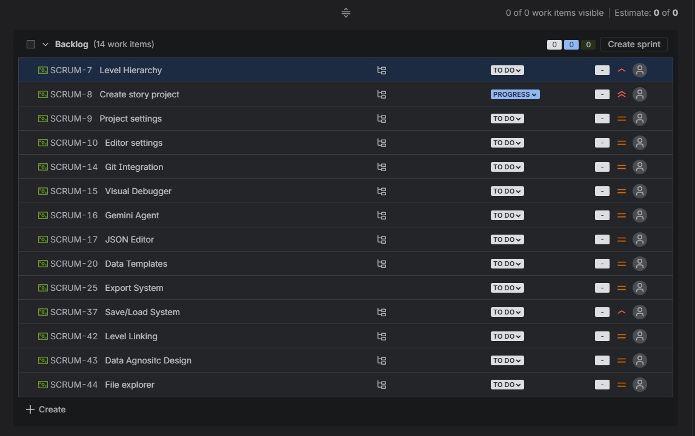
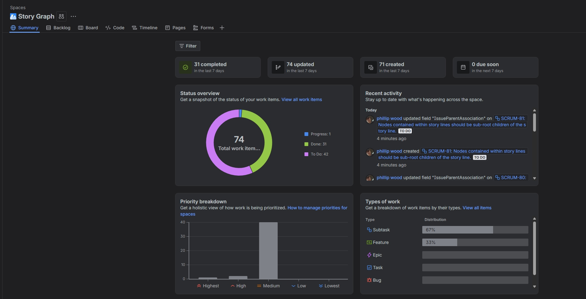
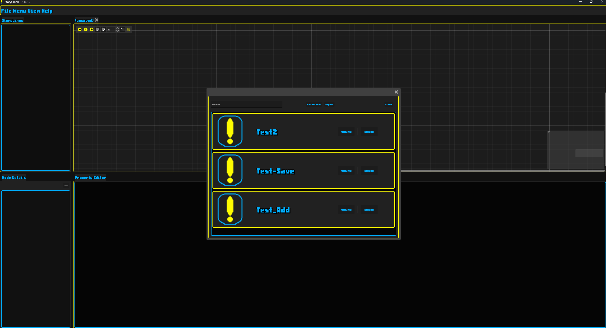
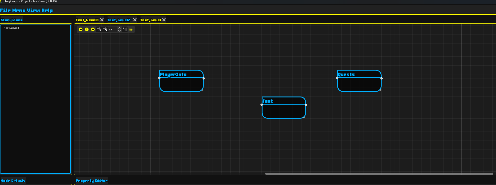
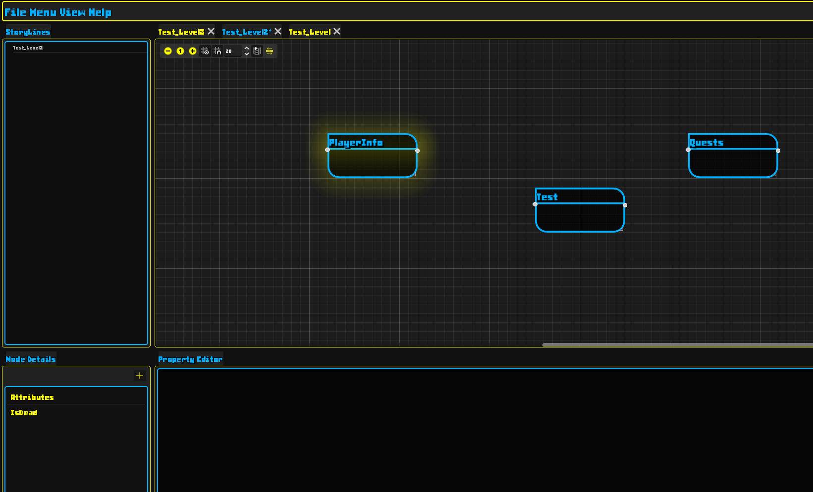
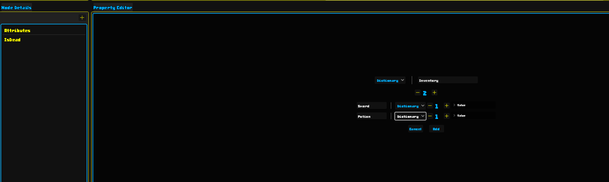
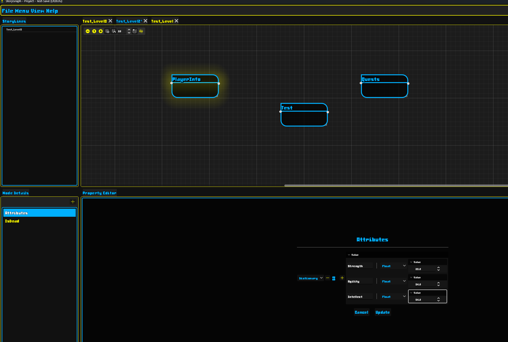

# Story Graph

## Introduction

Story Graph aims to make forming data relationships less taxing by adding a visual graphical element between the narrative designer and data modelled. Build in Godot version 4.5, as Godot has amazing capabilities when comes to building user interfaces. The engine also came with functionality such as a graph and node system that greatly saved me time and increased my agility. The godot documentation is also extremely friendly, as when I first started this project i was using Qt and QML. That was cumbersome, as the Qt documentation is harder to navigate than Godot's. The GDScripting language, offers reasonable speed for most task's and its simplistic design and how it's coupled with the editor offers great agility and dev experience. That is my reasoning for choosing the Godot Engine for this project.

## Project Features

Below I will include a snapshot of the project's backlog to give an overview of the features I am to implement in this application.

## Current Progress

The snapshot belows show's the current progress I have made on the project, and the overall task's needing to be completed. I have gotten most of the back bone done already, such as serializing data from node's and level's, saving and loading data, and creating a project structure. It is almost ready for alpha because the bare minimum use case of modeling level contained narratives for video games is nearly complete and ready for testing.

## Project Showcase

### The Project Hub

This window allows for project management. Selecting a project, deleting projects, renaming or creating a new project.

### Multiple Level's

You can have multiple level's open at a time, each level control their own state, and only the active level can be edited.

### Node Properties

Node properties are the data contained on that node. Property types range from primitive types such as, int, float, bool, and container types such as Array's and Dictionaries. They can hold strings(text) as well. Nested container types are supported as well. During testing I have made some pretty gnarly nests. There is an editor for adding new properties to the node, or updating the existing properties on the currently selected node. Since the storing of properties is essentially a dictionary. I have implemented a solution to ensure that a user can not overwrite an existing property.

## Conclusion

If you would like to build the program. A Godot version of 4.5 will work, you don't need .NET as I haven't included any C# yet, but that might change at a later date as I recently built my godot engine with .NET because I want to use interface's for a few features within the project, and GDScript does not offer that powerful feature. Once I get to a reasonable build for alpha I will add a release to GitHub.
